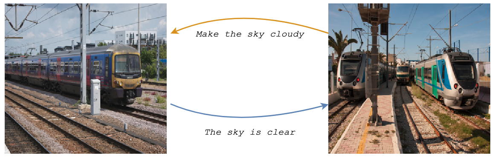
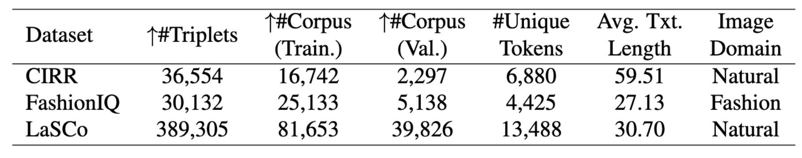
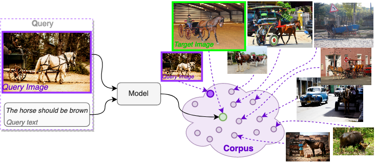

# [AAAI 2024] Data Roaming and Early Fusion for Composed Image Retrieval
#### [[Project Page](https://vision.huji.ac.il/lasco/) | [Paper (arxiv)](https://arxiv.org/abs/2303.09429)] #### 
Welcome to the official repository for the AAAI 2024 paper, "Data Roaming and Early Fusion for Composed Image Retrieval"!
## Table of Contents
1. [Abstract](#abstract)
2. [LaSCo Dataset](#lasco-dataset)
3. [Download](#download-lasco)
4. [About the task](#what-is-composed-image-retrieval-coir)
5. [Citation](#citation)
6. [License](#license)

## Abstract
>We study the task of Composed Image Retrieval (CoIR), where a query is composed of two modalities, image and text, extending the user's expression ability. Previous methods typically address this task by a separate encoding of each query modality, followed by late fusion of the extracted features. In this paper, we propose a new approach, Cross-Attention driven Shift Encoder (CASE), employing early fusion between modalities through a cross-attention module with an additional auxiliary task. We show that our method outperforms the existing state-of-the-art, on established benchmarks (FashionIQ and CIRR) by a large margin. However, CoIR datasets are a few orders of magnitude smaller compared to other vision and language (V&L) datasets, and some suffer from serious flaws (e.g., queries with a redundant modality). We address these shortcomings by introducing Large Scale Composed Image Retrieval (LaSCo), a new CoIR dataset x10 times larger than current ones. Pre-training on LaSCo yields a further performance boost. We further suggest a new analysis of CoIR datasets and methods, for detecting modality redundancy or necessity, in queries. 

---
## LaSCo Dataset
Large Scale Composed Image Retrieval (LaSCO) is a CoIR dataset, labeled on COCO images, based on [VQA2.0](https://visualqa.org/) annotations.
LaSCo contains 389,305 queries on 121,479 natural images.

 

In this study, we introduce a new large scale dataset for CoIR, dubbed LaSCo (Large Scale Composed Image Retrieval dataset). To construct it with minimal human effort, we employ a simple and effective methodology to rephrase labels from an existing large scale VQA dataset into a form suited for CoIR. LaSCo contains an open and broad domain of natural images and rich text. Compared to CIRR, it has x10 more queries, x—2 more unique tokens and x17 more corpus images. LaSCo further shows a significantly smaller bias towards a single modality for retrieval. Furthermore, pre-training our CASE model on LaSCo boosts performance on CIRR dataset, even at zero shot. VQA 2.0 dataset to create LaSCo with minimal human effort. 

 

## Download LaSCo
### Triplet annotations
* Download [Train Queries](downloads/lasco_train.json)
* Download [Validation Queries](downloads/lasco_val.json)

The annotations of queries and their targets are in the following format:
```
# List of dicts (triplets):
[
	# triplet dict:
	{'qid': 28714000, # id correspond to VQA2.0 qid
	'query-image': (28714, 'val2014/COCO_val2014_000000028714.jpg'), # id and path
	'query-text': 'The person is riding the bike', # transition-text
	'target-image': (277005, 'val2014/COCO_val2014_000000277005.jpg') # id and path
	}
	...
]
```

### Image files
LaSCo is annotated on [COCO](https://cocodataset.org/) images:
* Download [Train](http://images.cocodataset.org/zips/train2014.zip) images
* Download [Validation](http://images.cocodataset.org/zips/val2014.zip) images

The list of images included in the validation corpus (39,826 images) is available here:
[List of corpus Images](downloads/lasco_val_corpus.json) (validation split)
---
### What is "Composed Image Retrieval" (CoIR)?
Image Retrieval (IR) is a longstanding task that aims to find a desired image in a large corpus, given a user query. While content based image retrieval (CBIR) uses a single visual modality to capture the user intent, bi-modal interaction with the user can mitigate miss-interpretations.
In CoIR, the user's query is composed of image and text. The gist and attributes are more succinctly described visually, and further intent is specified via natural language.



## Citation
If you find our work useful for your research, please consider citing:
```
SOON
```

## License
This project is licensed under the MIT License - see the [LICENSE.md](LICENSE.md) file for details.
